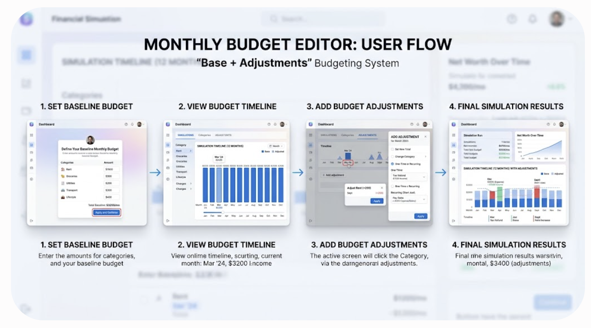

# Jobs & Household Redesign — Design Decisions

Working design log from a grilling session. Replaces the single scalar income
model with a unified, first-class Job / employment-history + household model,
delivered as an npm-library engine. Drivers: accurate SS AIME (per-year
earnings), realistic multi-person income, richer budgeting.

## Locked decisions

1. **Scope** = unified `Job` object as standing source of truth, replacing
   `Plan.incomeCents`, `JobChangeEvent`, and `careerStartAge`.
2. **Library shape** = npm engine; imperative-looking API over **immutable**
   data (pure core). Domain verb `addJob` (not `addJobEvent`). Writes flat on
   the root (`p.addJob(personId, job)`); reads may nest (`person(id).getJobs()`).
   Jobs keyed by calendar `startYear` at the boundary.
3. **Clock** = absolute calendar (canonical dates), NOT "min startYear as month 0"
   (avoids re-indexing when an older person is added). Cash-flow **sim still
   starts at "now"** — today's balance is a known input; never simulate past
   assets. Past earnings computed **directly** from jobs (pure), no past sim.
4. **Job spans** = `startYear` + `endYear | null`. `null`-end = the **career
   job** (ends at `retirementTargetAge`; the solver varies it). Explicit end =
   fixed-term/supplemental — past, straddling, or future; before or after
   retirement; independent of it. ≤1 `null`-end job per person. Career vs
   supplemental = `null` vs explicit end (no separate flag). Indefinite
   post-retirement work → give it an explicit end (e.g., life expectancy).
5. **Retirement** = `retirementTargetAge` (person-level INPUT) = **career exit**
   (subjective "retired"; may keep working). NOT "all earned income." Two
   SOLVER outputs: (1) **Career-exit age** — vary the career-job end, keep
   authored supplemental + passive; (2) **Work-optional age** — cease ALL jobs,
   survive on passive + SS + assets. Passive income never stops at retirement.
   Full-work-stop target = derived `max(job endYears)`. On-track % pairs with
   career-exit.
6. **Salary trajectory** = canonical per segment `(startingSalaryCents @ startYear,
   realGrowthPct)`, in today's dollars; engine does CPI indexing (SS) + nominal
   growth (forward). Entry modes are UI/API converters over that pair: default =
   two salary points → derive growth (start + current); advanced = enter growth
   directly (future jobs). Single forward rate for v1.
7. **Social Security** = per-year covered wages computed from jobs; AIME = sum of
   top-35 wage-indexed years (concave PIA bend points), with the per-year
   wage-base cap. Per-year detail matters most at cap crossings and >35-year
   careers.
8. **Household** = `Person[]`. `Person = { id, name, birthYear,
   retirementTargetAge, ssClaimingAge, jobs[] }`. Persons = standing data;
   join/leave (marriage/separation) = dated ledger events.
9. **Net worth** = HOUSEHOLD aggregate (not person 1). Per-person breakdowns
   underneath (SS record, deferral limits, RMDs are legally per-person).
10. **Accounts** = single canonical `household.accounts: Account[]`. Each carries
    `owners: PersonId[]` (`[p]` = individual, `[p1,p2]` = joint).
    `person.personalAccounts / .jointAccounts / .accounts` = pure selectors.
    Retirement ⇒ `owners.length === 1`. Net worth sums `household.accounts`
    **once** (no double-count). Goal fund accounts live in this list (goal holds
    `fundAccountId`; a dedicated account or an earmarked sub-balance).
11. **Deferral/match** = per-**job** pre-tax 401(k) deferral (dollars) + per-job
    employer match (`matchPct` up to `matchLimitPct`); per-**person** aggregate
    deferral cap (`deferralLimit.ts`). Match sits outside the employee limit.
12. **Budget** = prioritized **line-item allocation** of cash (expenses + dollar
    contributions to named accounts), replacing `expenseCents` scalar /
    `deferralPct%` / `surplusSwept`. Pre/post-tax treatment AND annual limits
    ride on the target account's **kind**; limits are legislated → rules/
    jurisdiction seam. Dollars, not %.
13. **401(k) reconciliation** = canonical on the job + an API-level unified
    `allocations()` view (single-source + derived selector, not UI-only). Reads
    unify; writes go to the canonical home (401k → job; post-tax → budget). Merge
    order mirrors cash-flow: pre-tax off gross (above the tax line) → tax →
    post-tax in user priority → surplus.
14. **Goals merged** into `allocations()`: a goal is a **computed** (deadline-
    paced, #26 logic) line item to its fund account. Goal semantics
    (target/deadline/disposition) stay on the goal.
15. **Waterfall ordering** = one flat priority-ordered list. Categories
    (needs/wants/savings) are descriptive (rings) AND a default-priority source
    (tiers), but NOT constraining (override allowed). Prepopulated default budget
    template + %-quickstart. Order = category tiers + defaults + optional
    per-item override. Order only bites in a shortfall (insolvency detector is
    the guardrail).
16. **Drawdown order** = forced per-person RMDs first, then tax-efficient default
    (taxable → pre-tax → Roth), overridable.
17. **Passive income** = generic standalone SS-EXEMPT stream `{ owners, startYear,
    endYear?, amountCents, growthPct, taxCategory, ssCovered: false }`. Not
    truncated by retirement.
18. **Standing data vs ledger** = standing data holds state + trajectory (jobs,
    accounts, budget lines, passive income, persons) with **dated overrides** for
    time-variation (extends §10.3 "value edits are overrides, not events"). The
    ledger keeps **discrete transactions** (home purchase, loan, debt payoff,
    child, marriage/separation). Retire `JobChangeEvent` + `BudgetItemStart/End`.
    **Undo everywhere**: add a plan-level history so standing edits undo like
    events.
19. **Line-item amount sources** = `{ literal, fill-to-limit, goal-paced }`.
    `literal` = fixed dollar; `fill-to-limit` = max the target account's annual
    cap (auto-follows the legislated catch-up bump at 50 — user authors nothing);
    `goal-paced` = the #26 deadline-paced sinking-fund computation. Time-variation
    = line-item **spans** (start/end) + **dated value overrides**. Catch-up: the
    *limit* rises automatically via the rules/jurisdiction seam (§12); *using* it
    is either `fill-to-limit` (automatic) or a dated override (explicit dollar).

20. **No `Adjustment` entity** = "adjustment" is a **UI/API verb only**, resolving
    to existing primitives — it is NOT a stored engine record. Each change lands
    in its correct home so reads never contradict, and undo/override is already
    handled by §18/§19 (no parallel replay mechanism). The routing table (which
    primitive a given adjustment becomes) lives explicitly in the UI/API layer:
    - one-time transaction (refund, bonus)  → **ledger transaction** (§18)
    - recurring change to spending/contribution → **dated override / span** on a
      standing budget line (§19)
    - income change (raise, new stream)      → **job / passive-stream override**
      (NOT a budget line — income lives on jobs/streams, §6/§17)

## UI: Base + Adjustments budget editor

Adopted UX vocabulary (mockup:
`docs/assets/budget-editor-base-adjustments.png`). Direct rendering of §18–§20.

- **Base** = the standing budget lines (§12/§15) — the user's normal recurring
  budget. Entered once (prepopulated default template + %-quickstart, §15).
- **Adjustments** = dated changes layered on the base. A single UI affordance
  with a **one-time vs recurring** toggle that routes per §20's table; there is
  no `Adjustment` record underneath.
- **Timeline / scrubber** = near-term shows a fine-grained (monthly) timeline;
  the multi-decade retirement horizon uses **age/milestone-anchored** adjustments
  ("at age 50 → fill-to-limit IRA", "at retirement → cut discretionary") at
  annual granularity. Same dated-override primitive, two navigation affordances —
  a 40-year month-by-month scrubber is a non-goal.
- **Income adjustments** (raise, bonus) appear in the same timeline but edit a
  **job/stream**, not a budget line (§20) — keep that seam clean to avoid the
  drift §13 guards against.

## Deferred / backlog
- Split forward-vs-back growth slope on a job (advanced, API-first).
- In-job raise schedule / multiple salary segments (advanced, API-first) — SS
  already handles per-year via segments.
- Asset-linked passive income → GitHub issue **#62**.
- Per-person surplus splitting (vs a single designated destination).

## Migration / build strategy

**Additive build, single hinge at #72, squash-merged** (NOT a permanent
strangler). End state: the scalar `Plan.incomeCents` / `createProjectionBase`
scalar authoring is fully removed — no version flag, no retained legacy path,
no supported coexistence in the shipped product. The multi-commit sequencing is
purely a within-branch reviewability/bisect device.

- Compilation target is unchanged: new authoring model (`Person` + `Job[]` + budget
  lines) compiles into the **existing** `LedgerBaseConfig` → `interpretLedger` →
  `Household` → `simulateHousehold` pipeline. Simulator/snapshot/ledger untouched.
- **Slices 1–8 are additive and stay green.** The Job/household model is built
  *alongside* the scalar path — both compile into the same `LedgerBaseConfig`, so
  slice 1 adds a small branch in compilation rather than ripping scalar out. The app
  keeps authoring via `incomeCents` and compiles/runs the whole way, so app-level
  tests stay trustworthy while features land.
- **No `fromLegacyPlan` adapter.** Because scalar income is never removed
  mid-branch, there is nothing to bridge — the throwaway converter is not built.
- **#72 is the single hinge** (the one breaking commit): it rewires the app's
  scattered `incomeCents` call sites to the `Job`/`Projection` model and deletes
  the scalar authoring in one go. Migration surface = `deferralLimit.ts`,
  `planDefaults.ts`, `budgetEditor.tsx`, `debugPanel.tsx`, `goalsView`,
  `retirementView` + engine `projectionBase` scalar authoring
  (`incomeCents`, `careerStartAge`, `JobChangeEvent`, `createProjectionBase`).
- **Commit discipline**: no red hinge is needed. The branch is **squash-merged**,
  so the multi-commit split is for review narrative, not bisect.

## npm API surface

Today there is **no facade**: the engine is a flat functional barrel
(`interpretLedger` → `buildHouseholdSimInput` → `simulateHousehold`) that the app
wires by hand, threading `ledger.nextSequenceNumber` into every form to mint ids.
The redesign introduces a facade.

- **Unified `Projection` root** (Q24=A). One stateful object owns everything.
  Standing edits (`addJob`, `addBudgetLine`, `setRetirementTarget`) and ledger
  transactions (`buyHome`, `marry`, `takeLoan`) are all methods on it; internally
  they route to standing data vs ledger per §18/§20, but the user sees **one
  object, one undo stack**. Reads nest (`p.person(id).jobs`,
  `p.household.accounts`, `p.allocations()`). "API papering over the split"
  (§13/§20) applied at the top level. Imperative-looking over an immutable core
  (§2): each write produces a new internal immutable state pushed onto history.
- **Creating writes mint a deterministic sequence id and return it; caller may
  override** (Q25=A). `const jobId = p.addJob(p1, {...})` → `"job-1"`. Counter
  lives in `Projection` state (deterministic, pure) and MUST be **serialized** so
  a reloaded plan continues the sequence and never collides. Returned handle is
  what §19 dated overrides target (`p.overrideLine(jobId, atAge(50), …)`).
  Optional `{ id }` in the payload for tests/round-trips. Replaces today's manual
  `nextId` threading.

- **Results: one `run(jurisdiction)` → immutable `ProjectionResult`** (Q26=A).
  Single pipeline pass. `Projection` = pure authoring state (jurisdiction-free);
  `ProjectionResult` = pure computed snapshot. Jurisdiction injected at `run()`,
  not construction, so one plan can be re-run under different rule sets. Result
  carries the existing per-month `ProjectionSeries` (net worth nominal+real,
  per-account balances, per-liability balances + payment records, per-property
  values, insolvency, per-month flows) PLUS the two §5 solver outputs
  (career-exit age, work-optional age) + on-track %. Solver runs in the same
  pass. Graph directly off the result — it is already a monthly accumulation
  table. Curve starts at "now" (§4.6, no pre-today history); month 0 is a
  flow-free opening snapshot.
- **Per-line monthly resolution in the result** (Q27=yes). Extend
  `ProjectionMonthFlows` with a **line-keyed map** (`lineMonthlyCents`): each
  budget line's monthly amount, by line id (same ids as the §13 `allocations()`
  authoring view — author line ↔ resolved line). Keep today's coarse rollups
  (`expensesCents`, `incomeByCategoryCents`) as convenience sums. Required to
  graph monthly budgets per line.

  The map reports the budget **as authored** — span, dated overrides and price
  growth applied — and is deliberately NOT rationed by the §15 waterfall in a
  tight month. This reverses the original intent (which was to show which line
  the waterfall "starved"), for two reasons found in implementation:

  1. The simulator never actually skips spending. An uncovered obligation is
     posted against the liquid account and cascades onto credit (§5.1), so a
     line reported below its amount describes money that WAS spent.
  2. Once savings and credit are both exhausted the month is insolvent, which
     `isInsolvent` already reports. "Starved" and "insolvent" collapse to the
     same condition, so the starved-line view added nothing.

  Deciding what spending to give up when a plan stops working is the user's
  call, not the engine's to assume. See issue #71.

- **Packaging: facade ships inside `@finley/engine`** (Q28=A) as the headline
  public API; the existing functional barrel (`interpretLedger`,
  `simulateHousehold`, …) stays exported as the low-level/advanced surface.
  Purity guard unchanged — internal history mutation is not I/O, and
  `Jurisdiction` is a `run()` argument (injected), never imported. One package.

## Open questions (remaining)
- None. The design tree is fully walked (scope → clock → jobs → retirement →
  salary → SS → household → net worth → accounts → deferral → budget → 401k →
  goals → waterfall → drawdown → passive → standing-vs-ledger → amount sources →
  no-Adjustment-entity → UI → migration → API surface). Next step is authoring
  the GitHub issue(s) and building per the B/multi-commit migration.
- Concrete npm API surface (Projection/Household facade, `run()`/`simulate()`,
  method set, packaging).

## Vocabulary
- **Job**: earned, SS-covered income stream (owner = person, span, salary
  trajectory, deferral + match).
- **Passive income**: unearned, SS-exempt stream; survives retirement.
- **Career job**: the `null`-end job; ends at `retirementTargetAge`.
- **retirementTargetAge**: career-exit input.
- **Career-exit age / Work-optional age**: the two solver outputs.
- **allocations()**: unified budget line-item view (job deferrals + budget +
  goals).
